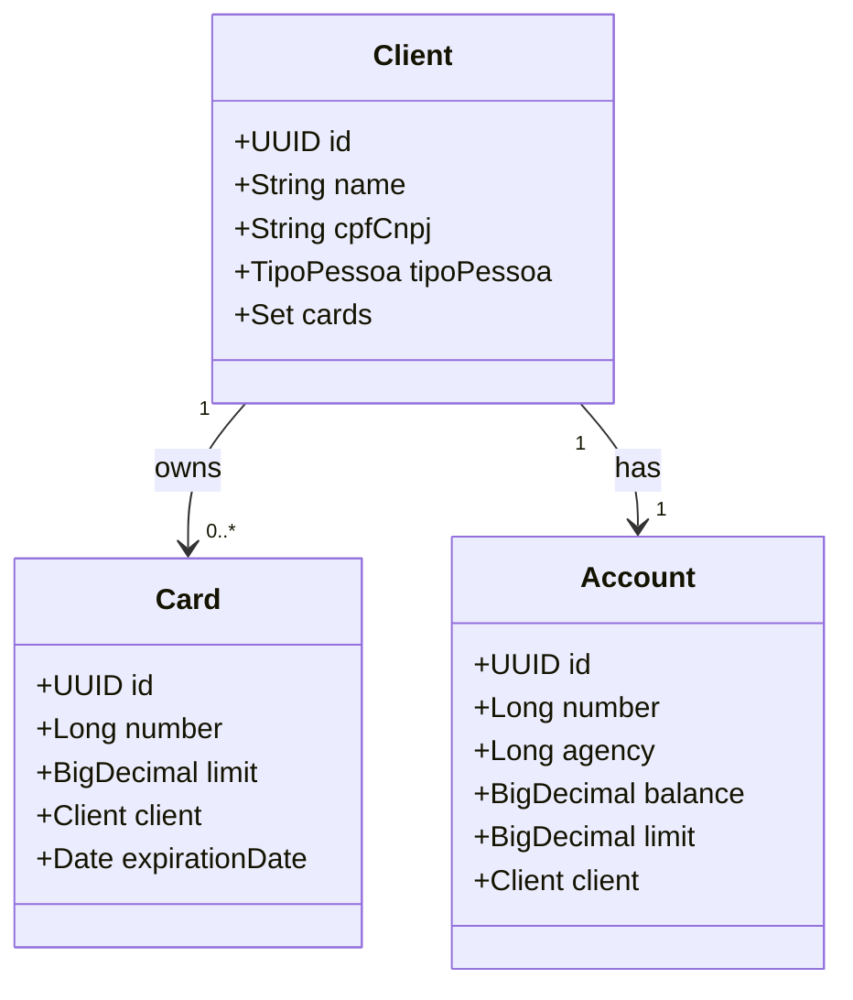

# projeto-final-dio
projeto-final-dio

```mermaid
classDiagram
    class Client {
        +UUID id
        +String name
        +String cpfCnpj
        +TipoPessoa tipoPessoa
        +Set<Card> cards
    }

    class Account {
        +UUID id
        +Long number
        +Long agency
        +BigDecimal balance
        +BigDecimal limit
        +Client client
    }

    class Card {
        +UUID id
        +Long number
        +BigDecimal limit
        +Client client
        +Date expirationDate
    }

    Client "1" --> "0..*" Card : owns
    Client "1" --> "1" Account : has
```
